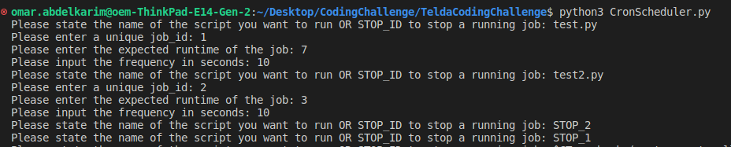

# TeldaCodingChallenge

## Brief Explaination + Reasoning
    The task is to implement a functionality in which a user has to provide multiple jobs along with the ID and frequency, and to organize those tasks in a manner that all jobs are executed concurrently. So the approach and methodology was applied as follows:
        1. Shedule module:
            a. A challenge I encountered here, was that python natively freezes the code until the line executed, so to keep track of the runtime/timelimit; I used the subprocesses.Popen method which happens in the background, and in parallel to it a separate method was used to calculate the runtime and terminate the job in case of runtime exceeded.
            b. The frequency is implemented using the time.sleep() method within a process as it will freeze the whole thread/process.
        2. Allow the user to have certain implementation, in this part multiple approaches could've been used including but not restricted to:
            - opening a Nano command to let the user implement the functionality then save the file in the required format.
            - Assuming the user has an already existing functionality (python script for example), then use the subprocess module to call this file in the periodical requirements. (chosen approach) (N.B: the funcionality for now only supports python files, but in the future a dictionary with the formats can be used to call the right command for running the file).
        3. Running multiple process concurrently, here there was a choice between multiprocessing and threading libraries, I chose the multiprocessing as to allocated each job its own resources under the assumption that the processes are mutually exclusive.
        4. Tracking the active processes by storing them in a dictionary with ID as a key in case the user wants to terminate a job, they can just type (STOP_{job_ID}).
        5. The entire code I tried to write it following the best structure I can think of to correctly have test cases that covers main functionalities.
        NB A diagram that briefly explains the flow


## Usage

1. To run clone the repo in your directory
```bash					
git clone https://github.com/decapood/TeldaCodingChallenge.git
```

2. To start your first run 
```'bash
python3 CronScheduler.py
```

3. You will then be prompted to input the required function as shown below.
### Example run display

### Example Log display


## Possible future improvements
    a. The structure is built in a way that it can support freezing a certain process for a while, terminate, re-execute the job again but only terminate is available.
    b. Warnings and exceptions with explaination can be added to each functionality to keep better track of any future complexities.
    c. The file and code structure is not scalable as it was done as a simple functionality, in an ultimate environment you would have a file for a cron job and a seperate one for scheduling, some more in depth resource allocation depending on the program needed space/CPU usage.
    d. There is an assumption that no job will fail, so if it fails the whole process will go under an error while the program is still running.
    e. In case the runtime exceeds the frequency, I was not sure how to handle that but in this program the job will continue executing as long as the runtime did not exceed the user's mentioned runtime.
